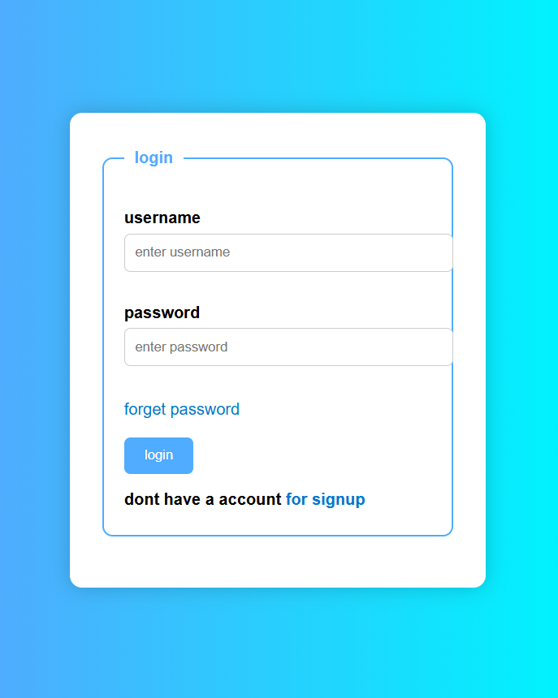
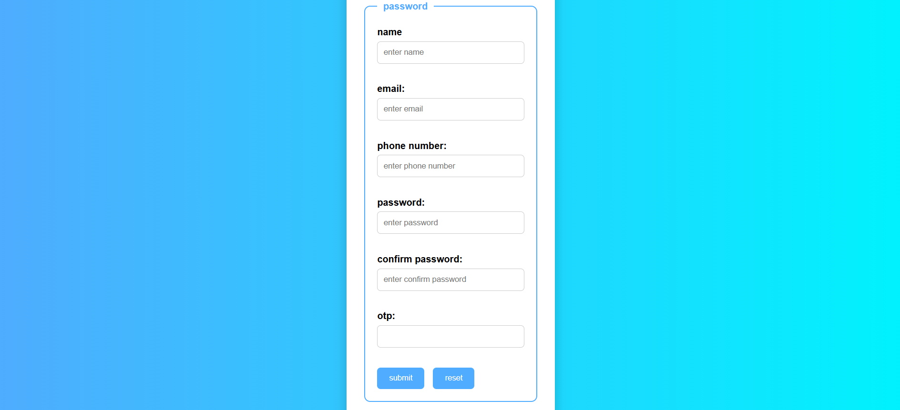

# AuthUI

AuthUI is a responsive and simple front-end authentication interface built using only HTML and CSS.

## 🔐 Features
- Login page (index.html)
- Signup page (signup.html)
- Forgot password page (password.html)
- Shared modern styling using style.css

## 🌐 Pages and Navigation
- From Login Page:
  - Login using username and password
  - Link to “Forget Password”
  - Link to “Signup”

- From Signup Page:
  - Register with name, email, password, confirm password

- From Forget Password Page:
  - Recover password using email, phone number, and OTP

## 📁 Folder Structure
AuthUI/
├── index.html
├── signup.html
├── password.html
├── style.css
└── README.md

## 🚀 Technologies Used
- HTML5
- CSS3

## 📸 Preview

## 📌 License
Free to use for personal or educational purposes.

